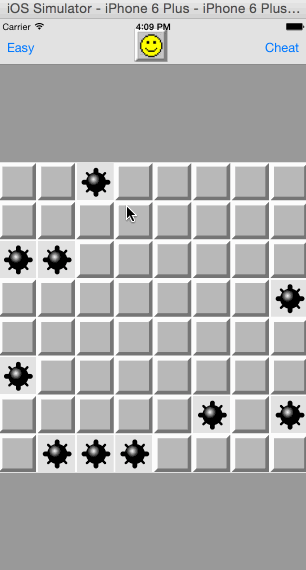
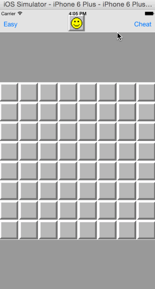

# MineSweeper

Date: Fri Feb 13 15:08:39 PST 2015

# Features:

* Board starts with 8x8 grid and by default 10 hidden mines are randomly placed into the board.
* New Game: start a new, randomly generated game.
* Validate: check that a user has correctly marked all the tiles and end the game in either victory or failure
* Cheat: in any manner you deem appropriate, reveal the locations of the mines without ending the game.
* changing difficulty level
* changing the size of the board

# Demo

See demo folder

